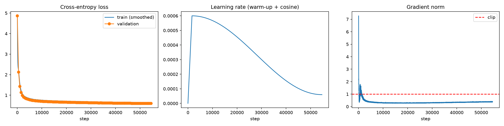

# Task 1 – GPT-Style Character-Level LLM from Scratch (Manjot)

**Run ID:** `20261002_045745` · **Final checkpoint:** `checkpoints/20261002_045745_epoch10_weights.pt`
**Notebook:** `src/task1.ipynb` · **Metrics:** `metrics_report.csv` · **Failure analysis:** `failure_analysis.md`

No prebuilt Transformer or attention modules were used (`nn.Transformer*`, `nn.MultiheadAttention` and `F.scaled_dot_product_attention` are all unused). Attention, causal masking and LayerNorm are implemented by hand.

---

## 1. Data preprocessing (1.1)

| Item | Value |
|---|---|
| Source | `roneneldan/TinyStories`, train split (2,119,719 stories) |
| My split | Shuffled with seed 42, empty stories skipped; **100,000 train / 10,000 validation** stories. Indices saved to `data_processed/split_indices.npy`. |
| Story length (train) | mean 894, median 787, max 4,216 characters |
| Tokenisation | Character level, own `char_to_idx` / `idx_to_char` built from **training text only** |
| Vocabulary | **115** = 113 characters + `<unk>` + `<eos>` |
| Unseen characters in validation | 3 (mapped to `<unk>`) |
| Encoded size | 89,508,301 train / 8,944,320 validation tokens (including one `<eos>` per story) |
| Sequences | Block size **256**, non-overlapping chunks; input `x = ids[i:i+256]`, target `y = ids[i+1:i+257]` |
| Number of sequences | 349,641 train / 34,938 validation |

**Definition of one epoch:** one pass over all 349,641 non-overlapping training chunks = 5,463 steps at batch size 64.

**Notes:**
- `<eos>` marks story boundaries so the model can learn when a story ends.
- The vocabulary contains a few noisy symbols (e.g. `Ã`, `â`, `€`) caused by encoding errors in the original dataset. They are rare and kept as-is.

---

## 2. Model (1.2)

| Component | Choice |
|---|---|
| Token embedding | `nn.Embedding(115, 256)` |
| Positional embedding | learned, `nn.Embedding(256, 256)` |
| Transformer blocks | **4**, pre-norm: `x + Attn(LN(x))`, then `x + FFN(LN(x))` |
| Attention | **4 heads**, head dimension 64, fused QKV projection, scaled dot-product with **causal lower-triangular mask** (future positions set to −∞ before the softmax), output projection |
| Feed-forward | 256 → 1024 → 256, GELU |
| LayerNorm | own implementation (mean/variance normalisation with learnable scale and shift) |
| Dropout | 0.1 (embeddings, attention weights, residual paths) |
| LM head | final LayerNorm + `Linear(256, 115)` |
| Initialisation | weights N(0, 0.02), biases 0 |
| **Parameters** | **3,284,083** |

**Why these sizes:** About 3.3M parameters is a good fit for about 90M training characters (roughly 27 characters per parameter). It is large enough to learn spelling, grammar and simple story structure, and small enough to train 10 epochs in about 30 minutes. Block size 256 covers about a third of an average story; longer contexts would cost more, because attention is O(T²).

**Sanity checks before training:**
- Initial loss 4.863, close to the theoretical ln(115) = 4.745 for uniform guessing.
- **Causality test:** changing the character at position 100 left the predictions for positions 0–99 unchanged (`True`) and changed the predictions from position 100 onward (`True`).
- Overfitting a single batch: loss went from 4.74 to 0.13 in 200 steps, confirming the model can learn.

---

## 3. Training (1.3)

| Hyperparameter | Value | Reason |
|---|---|---|
| Loss | Cross-entropy on next-character prediction | standard language-modelling objective |
| Optimiser | AdamW, β = (0.9, 0.95) | β₂ = 0.95 reacts faster to gradient changes, which is more stable for Transformers |
| Weight decay | 0.1 on weight matrices only | biases and LayerNorm parameters are not decayed |
| Peak learning rate | 6e-4 | typical for small GPT models |
| Warm-up | linear, 1,638 steps (3%) | avoids large unstable updates while weights and Adam statistics are still random |
| Schedule | cosine decay to 6e-5 | large steps early, fine adjustment late |
| Gradient clipping | 1.0 | protects against occasional exploding gradients |
| Batch size | 64 sequences × 256 = 16,384 characters per step | |
| Epochs | **10** (54,630 steps) | meets the minimum of 10 epochs |
| Precision | bf16 autocast on GPU | faster, less memory, no loss scaling needed |
| Evaluation | every 500 steps on 100 validation batches; full validation set at the end | |
| Seed | 42 | |

Checkpoints were saved after every epoch (model and optimiser state).

---

## 4. Results

### Metrics (from `metrics_report.csv`)

| Metric | Value |
|---|---|
| Training cross-entropy (dropout off) | **0.601** |
| Validation cross-entropy | **0.611** |
| Perplexity | **1.84** |
| Bits per character | **0.882** |
| Generalisation gap (val − train) | **0.010** |
| Top-1 next-character accuracy | **80.6%** |
| Gradient norm (mean / max) | 0.35 / 7.28 |
| Fraction of steps clipped | 1.2% (almost all during the first steps / warm-up) |
| NaN / inf losses | 0 |
| Loss spikes (> 1.5× running average) | 0 |
| Parameter count | 3,284,083 |
| Training throughput | ~520,000 tokens/s (median) |
| Generation speed | 323 characters/s |
| Peak GPU memory | 1.60 GB |
| Total training time | 1,829 s (about 30.5 minutes) |

### Generation diversity

| Decoding | Distinct-1 | Distinct-2 | Distinct-3 | Repeated 4-gram rate |
|---|---|---|---|---|
| Greedy | 0.255 | 0.437 | 0.530 | **0.308** |
| Temperature 0.7 | 0.341 | 0.714 | 0.882 | 0.021 |
| Temperature 1.0 | 0.394 | 0.817 | 0.947 | 0.000 |

(Word-level n-grams over all samples for each setting.) Diversity rises steadily from greedy to temperature 1.0. Under greedy decoding about 31% of word 4-grams are repeats, which confirms the looping seen in the samples; at temperature 0.7 it drops to 2%, and at 1.0 to zero.

### Training curves

- **Loss:** drops from about 4.9 to about 1.0 within the first ~2,000 steps (the model learns common characters, spelling and frequent words first), then slowly improves to about 0.6. Validation follows training closely throughout.
- **Learning rate:** linear warm-up to 6e-4, then cosine decay to 6e-5, as designed.
- **Gradient norm:** one large spike (about 7) in the first few steps while the weights are random (clipping limits it to 1.0), a small bump near the end of warm-up, then stable at about 0.35 for the rest of training.

### Sample generations

See `outputs/samples_20261002_045745.txt`. Example (temperature 0.7):
> "Once upon a time, there was a small boy called Tim. Tim was three years old and loved to explore. One day, Tim saw a little boy who was crying."

---

## 5. Hardware disclosure

| | |
|---|---|
| Final training run | **NVIDIA GeForce RTX 4090 (24 GB)** on RunPod, PyTorch 2.8.0+cu128, Python 3.12.3 |
| Development / smoke test | Apple Silicon MacBook Pro (MPS), PyTorch 2.14.1, Python 3.11.12 |
| Manifests | `reproducibility/manifests/manjot_task1_requirements.txt` (Mac), `manjot_task1_requirements_gpu.txt` and `manjot_task1_hardware.txt` (GPU) |
| Raw logs | `reproducibility/raw_logs/manjot_task1_20261002_045745.csv` (+ `_config.json`, `_summary.json`, `manjot_task1_nbconvert.out`); smoke-test log `manjot_task1_20261001_195753_smoke.*` |

**Reproduce:** set `SMOKE = False` in the notebook and run
`jupyter nbconvert --to notebook --execute --inplace src/task1.ipynb`
(set `SMOKE = True` for a quick 2-epoch test on a small subset).

---

## 6. Observations and next steps

- **Almost no overfitting** (gap 0.01). The model is limited by capacity rather than data, so a larger model (more layers or a wider d_model) would likely reach a lower loss.
- **Decoding matters:** greedy decoding loops and repeats; temperature 0.7 gives the best balance; temperature 1.0 is more varied but less coherent (see `failure_analysis.md`).
- **Long-range coherence** is the main weakness: characters and names drift. A longer context window or subword tokenisation would help.
- **Generation is slow** (323 characters/s) because every new character re-runs the model over the full context. A **KV cache** would make generation much faster.
